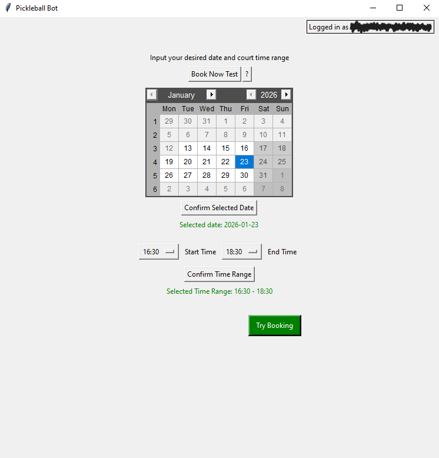

# Pickleball Booking Bot
This bot automatically books courts on the city of Hamilton's website for outdoor pickleball. I made this bot because my brother was having difficulty acquiring a spot for pickleball during busy times.



### PyInstaller Compatible
Since this bot was intended for my brother, who has no programming knowledge, I made the app compatible with PyInstaller so that I could give him an executable. If you would like to use the same distribution method, use the following command with PyInstaller installed:

``` console
pyinstaller --add-data="data.json:." app.py
```

### How the Bot Works
Everyday at 12:30PM, the website opens up its bookings for timeslots 2 days in advance. For example, all the slots for Friday become available on the same week's Wednesday at 12:30PM. When clicking on a booking link, the user is able to hold the booking for 5 minutes, preventing other users from booking the same slot. This bot takes the desired time range of the user and holds every available booking. Then it books 1 slot from each time interval. The remaining booking slots are returned so that others can book their own times.

#### WARNING: Intrusive Implementation
Since this program was only intended to be used by 1 person, I made the program extremely selfish to maximize its efficiency. However, the use of this bot is not recommended for many users, due to the greedy nature of holding all bookings at particular time frames.

### Book Now Test
On the first launch of the app, files sometimes don't load properly, leading to errors when booking. Try to book an available court on the first boot-up of the program to ensure that the program works for its intended use case of booking at 12:30PM for courts in advance.

## Learnings

#### Requests and Sessions
It was fascinating to see how websites monitor the user when they try to access the site; this allowed me to learn a lot about cookies and bot detection.

#### Tokens and Hidden Variables
It turns out that you often carry a token with you between each page of a website. It was interesting to see how these tokens were used to track your activity. It was also somewhat frustrating to learn that some values are only visible in the embedded script attributes of a web page. This was important to know when trying to check for dynamically loaded values of available bookings.

#### Tkinter
This was the first time I've used Tkinter, since I wanted to give my brother a UI without having to make an entire front-end website. The structuring of elements reminded me a lot of the component-based nature of React, but perhaps all front-end frameworks follow this principal. Overall, it turned out alright and let me brush up on my object-oriented programming.

#### Data Management in Memory
I created a data manager script to keep track of the user's login information across different processes in memory. If this were to be upscaled for multiple users, it would likely be pretty easy to replace my JSON data file checks with database queries instead.